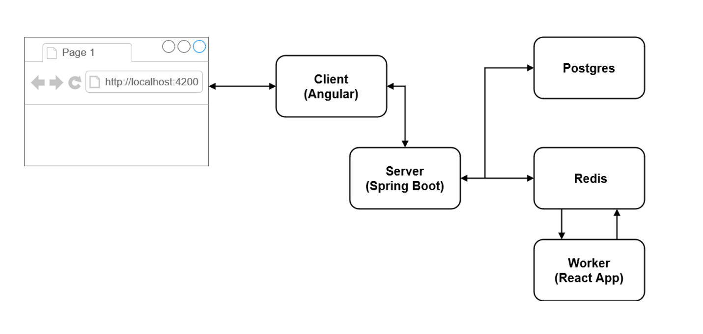
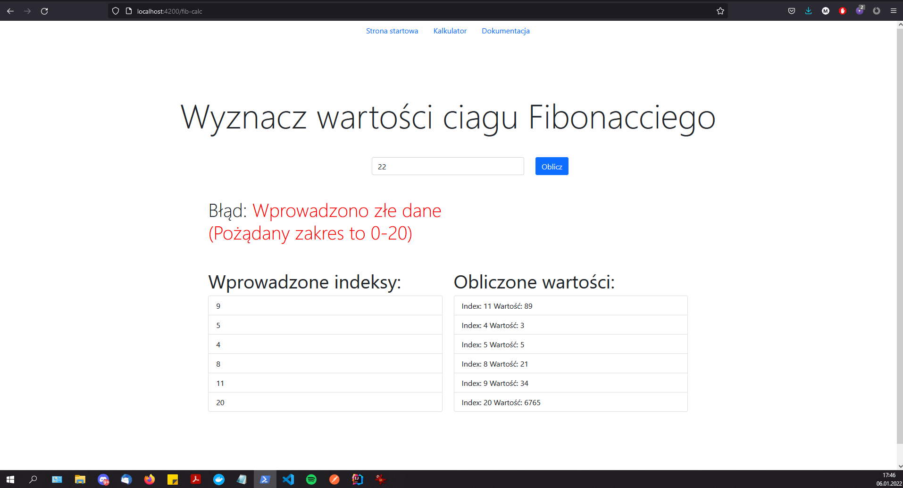
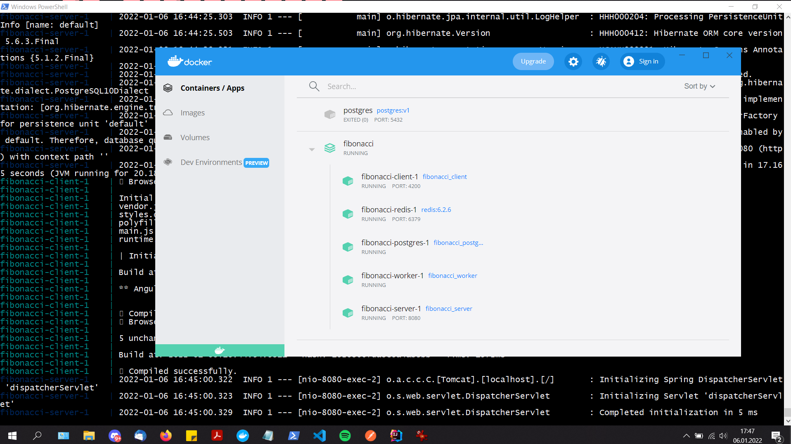

# Laboratorium PFSwCh0 Zadanie 1

## Uruchomienie usługi 

Należy otworzyć terminal w głównym katalogu projektu, a następnie wydać polecenie:  
`docker compose -f docker-compose.dev.yml up --build`   Po uruchominiu wystarczy w przeglądarce wpisać adres: http://localhost:4200 

## Architektura usługi

Usługa składa się z 5 mikroserwisów:

- aplikacji klienckiej (Angular),
- serwera (Spring Boot),
- bazy danych (Postgres),
- bazy danych (Redis),
- worker-a (React App) - modyfikacja z lab 9 (dodano wydajniejszy algorytm).

## Funkcjonalności

Dla użytkownika dostępne są trzy strony:
- startowa - wyświetlająca informacje autorze,
- kalkulator - pozwalająca na wprowadzenie kolejnych wyrazów ciągu Fibonacciego (ograniczenie: największy wyraz ciągu (k), gdzie k <= 20), wyświetlająca wszystkie wprowadzone wyrazy oraz wyliczone wartości dla wprowadzonych wyrazów,
- dokumentacja - wyświetlająca opis usługi.

## Działanie kalkulatora

1. Użytkownik wprowadza wyraz ciągu.
2. Aplikacja kliencka przesyła liczbę do serwera.
3. Serwer zapisuje wprowadzony przez użytkownika wyraz do bazy danych (Postgers), jeśli jeszcze nie istnieje w bazie. Następnie wstawia wyraz do bazy drugiej bazy (Redis) oraz powiadamia workera.
4. Worker oblicza wartość ciagu dla zadanego wyrazu i umieszcza wynik w bazie (Redis).
5. Aplikacja kliencka odpytuje serwer o wyniki oraz wyrazy z bazy (Postgres).
6. Serwer przesyła zapytanie do bazy (Redis) oraz bazy (Postgres).
7. Wynik jest wyświetlany na stronie.

## Połączenia

Aplikacja kliencka (Angular) wyswietla stronę na http://localhost:4200, komunikuje się z serwerem (Spring Boot) poprzez port 8080. Serwer komunikuje się z bazami danych Postgres oraz Redis odpowiednio na portach 5432 i 6379. Worker współpracuje tylko z bazą Redis, nasłuchuje na zdarzenie, gdy wystąpi oblicza wartość ciągu dla zadanego wyrazu i wstawia wynik do bazy.

## Potwierdzenie działania usługi

